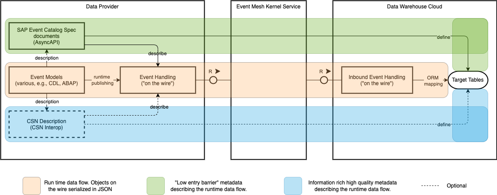

# CDS CSN to AsyncAPI specification for SAP ecosystem Mapping - Architecture Decision Records

This document shall record all important challenges, decisions and consequences regarding the generation of [AsyncAPI specification for SAP ecosystem](https://github.tools.sap/CentralEngineering/asyncapi-specification) documents from [CDS](https://pages.github.tools.sap/cap/docs/cds/)/[CSN](https://pages.github.tools.sap/cap/docs/cds/csn) models.

## Contents

- [ADR00: The generation will start by using CSN `inferred` flavor, but relies on the later introduction of CSN `interop` (aka. `effective`)](#adr00-the-generation-will-start-by-using-csn-inferred-flavor-but-relies-on-the-later-introduction-of-csn-interop-aka-effective)
- [ADR01: The generation functionality is implemented as part of the CAP compiler, similar to the existing OpenAPI generator](#adr01-the-generation-functionality-is-implemented-as-part-of-the-cap-compiler-similar-to-the-existing-openapi-generator)
- [ADR02: The compiler works specific to TG27 - Business Events and its requirements](#adr02-the-compiler-works-specific-to-tg27---business-events-and-its-requirements)
- [ADR03: The compiler does only consider events declared as part of a service](#adr03-the-compiler-does-only-consider-events-declared-as-part-of-a-service)
- [ADR04: The compiler does consider the events as directed outbound (published)](#adr04-the-compiler-does-consider-the-events-as-directed-outbound-published)
- [ADR05: The compiler does group by services](#adr05-the-compiler-does-group-by-services)
- [ADR06: The compiler does not support custom context attributes for the time being](#adr06-the-compiler-does-not-support-custom-context-attributes-for-the-time-being)
- [ADR07: The compiler does construct the event type from namespace, service name, and event name](#adr07-the-compiler-does-construct-the-event-type-from-namespace-service-name-and-event-name)
- [ADR08: The event major version must be provided as part of the event name](#adr08-the-event-major-version-must-be-provided-as-part-of-the-event-name)
- [ADR09: Association are included as objects containing the key(s)](#adr09-association-are-included-as-objects-containing-the-keys)
- [ADR10: Association to many are included as array of objects containing the key(s)](#adr10-association-to-many-are-included-as-array-of-objects-containing-the-keys)
- [ADR11: Nullable attributes may be omitted and are not explicitly described with null union types](#adr11-nullable-attributes-may-be-omitted-and-are-not-explicitly-described-with-null-union-types)
- [ADR12: Keys and mandatory attributes are listed as required](#adr12-keys-and-mandatory-attributes-are-listed-as-required)
- [ADR13: Structured types are objects and not flattened out](#adr13-structured-types-are-objects-and-not-flattened-out)
- [ADR14: Decimal precision and scale are expressed via `x-sap-precision` and `x-sap-scale`](#adr14-decimal-precision-and-scale-are-expressed-via-x-sap-precision-and-x-sap-scale)
- [ADR15: `@AsyncAPI.Extensions` can be used for developer-defined extensions](#adr15-asyncapiextensions-can-be-used-for-developer-defined-extensions)
- [ADR16: CLI flag `merged` ignored `@AsyncAPI.Extensions` with `service` as target](#adr16-cli-flag-merged-ignored-asyncapiextensions-with-service-as-target)

## ADR00: The generation will start by using CSN `inferred` flavor, but relies on the later introduction of CSN `interop` (aka. `effective`)

- status: accepted
- date: 2023-01-19

### Decision

It has been decided that the generation functionality is started using CSN `inferred` flavor.
This is a stop gap measure to get started and CSN `inferred` is the flavor closest to the eventual CSN interop/effective flavor.

### Consequence

The generation functionality can start, but it must be updated later on to work on the CSN interop/effective flavor.

### Context

This is a simplification of the [ACD Metadata for DPS Data Ingestion](https://sap.sharepoint.com/teams/CPADataManagement/Shared%20Documents/Forms/AllItems.aspx?id=%2Fteams%2FCPADataManagement%2FShared%20Documents%2FWG%20Data%20Architecture%2F20%5FDocs%5Fand%5FMaterial%2F50%5FWorkstreams%2FWS%20E2E%20Metadata%2FWG%5FDataArch%5FACD%5FE2E%5Fmetadata%5FDPS%5F1%2D0%2Epdf&parent=%2Fteams%2FCPADataManagement%2FShared%20Documents%2FWG%20Data%20Architecture%2F20%5FDocs%5Fand%5FMaterial%2F50%5FWorkstreams%2FWS%20E2E%20Metadata).
Please see this doc for full context.

When replicating data from a data provider to a data consumer, we rely on metadata to describe this data. For this metadata, TG27 (Business Events) established the AsyncAPI specification for SAP ecosystem (AsyncAPI 2.0) as the common and low entry barrier description format for the events (AsyncAPI is an open industry standard).
It is a mandatory requirement from TG27 to describe all published events in an AsyncAPI specification for SAP ecosystem document.
In those documents, a collection of related events (JSON serialization) is described, mostly using JSON Schema (denormalized description).
It consequently does not provide richer information like the relationship model which may be of interest for generic replicators for instance.

The Data Plane Service (DPS) was considered to be such a replicator and filed the initial request for this effort.
In the meantime, priorities have changed and DPS does not exist as such any longer.
However, the requirement is still valid and still applies for instance to Data Warehouse Cloud (DWC).
In the context of DWC and event ingestion, the preferred approach for DWC is to receive CSN descriptions of the event models so that it can easily create the target tables (relational) from this CSN description.
If data providers are capable of producing CSN descriptions, they therefore should leverage the higher quality CSN description for the DWC integration (this is as of now even required for the TSM frontrunner).
If not, the DWC must fall back to the lower entry barrier event catalogs to create the target tables which may require additional manual care for the target tables.

In order for this to work consistently, the following is needed:

- A well specified CSN interop flavor for data exchange
  - Ideally reduced to a minimal feature set for easier adoption (not all CSN providers or consumers are CAP applications)
  - “CSN interop as the agreed CSN flavor for data exchange between CAP, ABAP Platform, DWC, …"
- A well specified mapping from CSN interop to JSON (events)
  - As the CSN is used to describe the events, it must be ensured that the JSON serialization is the same for every provider
  - This mapping is specified via the CSN->EventCatalog mapping
    - JSON Schema part of the event catalog describes precisely how the JSON serialization of events must look like
    - All data providers are required to describe event catalogs => can simply be generated from the higher quality CSN if available

The given effort targets the latter, a well specified mapping from CSN to JSON (events).

This overall understanding is described in below picture. In orange, the runtime event flow with events exchanged between the provider and DWC via Event Mesh Kernel Service. In green, the low entry barrier Event Catalog to describe the events, and to create target tables from. In blue, the optional but higher quality CSN interop to describe the events, and to create target tables from.



Now, in the absence of the specified interop CSN, it must be decided whether the generation functionality is started based on another CSN flavor, or if it must wait until CSN interop is specified.

## ADR01: The generation functionality is implemented as part of the CAP compiler, similar to the existing OpenAPI generator

- status: accepted
- date: 2023-01-19

### Decision

It has been decided that the generation functionality is implemented as part of the CAP compiler.
It shall work as similar as the existing [OpenAPI generation](https://pages.github.tools.sap/cap/docs/advanced/openapi) as possible.

The target name `asyncapi` is chosen as it is the stable open industry term and SAP has the habit of renaming things frequently.

### Consequence

The new target (`-2 | --to`) format `asyncapi` is added to the CAP CDS compiler.

### Context

The aim of this effort is to provide tooling that allows the generation of AsyncAPI specification for SAP ecosystem documents from CDS/CSN models.
A similar effort has been undertaken already with the [ODM Events Catalog](https://github.wdf.sap.corp/DMA/ODM-Events-Catalog) which created AsyncAPI specification for SAP ecosystem documents from ODM CDS models. The ODM Events Catalog is a standalone tooling.

It had to be decided whether a new standalone tooling is created or existing tooling is reused.

## ADR02: The compiler works specific to TG27 - Business Events and its requirements

- status: accepted
- date: 2023-01-19

### Decision

It has been decided that the compiler works specific to [TG27 - Business Events](https://github.tools.sap/CentralEngineering/TechnologyGuidelines/tree/main/tg27) and its requirements.

Background of the decision is that CAP has no intrinsic requirement of documenting events or messages in AsyncAPI outside of the scope of cross-application eventing where TG27 applies and its requirements must be followed.

### Consequence

The compiler uses [AsyncAPI specification for SAP ecosystem](https://github.tools.sap/CentralEngineering/asyncapi-specification) ([AsyncAPI 2.0.0](https://www.asyncapi.com/docs/reference/specification/v2.0.0) flavor) to describe events that follow the [CloudEvents specification for SAP ecosystem](https://github.tools.sap/CentralEngineering/cloudevents-specification) ([CloudEvents](https://github.com/cloudevents/spec/blob/v1.0/spec.md) flavor) format at runtime.
It does not support generating vanilla AsyncAPI documents describing arbitrarily formatted events.

Still, even though the tooling targets CloudEvents specification for SAP ecosystem format, the developer has to follow TG27 requirements when modelling the events.
For instance, chosen event names must be compliant to the rules for the event `type`.

### Context

CAP is not tied to a certain eventing or messaging technology.
It additionally gives the developer freedom in the modelling of their events as needed, but it supports [CloudEvents](https://pages.github.tools.sap/cap/docs/guides/messaging/#cloudevents) format as an explicit setting.
It also already supports [SAP Event Mesh default service plan](https://pages.github.tools.sap/cap/docs/guides/messaging/#using-sap-event-mesh).
The new [SAP Event Mesh Kernel Service](https://sap.sharepoint.com/sites/203423/SitePages/Onboarding-Guide-for-Event-Mesh-Kernel-Service.aspx) plans are not yet supported, but will be in the future (no committed timelines yet).

It must be decided whether the compiler is specifically targeting TG27 and its specified event and documentation formats, or whether it additionally supports vanilla AsyncAPI describing arbitrarily formatted events.

## ADR03: The compiler does only consider events declared as part of a service

- status: accepted
- date: 2023-01-19

### Decision

It has been decided that the compiler does only consider events that are declared as part of a service.
Major reason being that services establish the interface to the outside and it is currently unclear how events outside of a service should be treated.

### Consequence

The compiler ignores all events that are declared outside of a service.
If the requirement to consider events outside of services is put forward in the future, the proper means for supporting this must be found and the tooling must be updated again.

### Context

CDS is using the concept of _services_ as collections of exposed entities.
Typically, services are used as the abstraction layer for how entities of the data model are exposed to the outside.
In addition, CDS also allows to define events outside of a service.

It must be decided whether the compiler takes all found events into account or only those defined as part of the service.

## ADR04: The compiler does consider the events as directed outbound (published)

- status: accepted
- date: 2023-01-19

### Decision

It has been decided that the compiler only considers outbound events and that those are always considered as active.
External services (defining inbound events) are ignored.

### Consequence

The documents generated by the compiler describes the events as actively published.
This is expressed by adding a `channels` entry for the event using the `subscribe` operation (:exclamation: AsyncAPI uses `subscribe` to express that the application describing itself publishes something).

### Context

The AsyncAPI specification for SAP ecosystem supports to define the direction of the described events and whether they are active or not.
I.e., whether they are outbound (aka. emitted, published), or inbound (aka. consumed).

CAP has the notion of services and considers events declared in an own service as outbound.
Events that are to be consumed within a CAP application are declared as part of an _external service_.
There is no special notion of declaring if an event is active or not.

It must be decided how the direction of events is considered by the compiler.

## ADR05: The compiler does group by services

- status: accepted
- date: 2023-01-19

### Decision

It has been decided that the compiler follows the existing OpenAPI generator and applies the `--service` option.
In addition, the CLI flag `--asyncapi:merged` is introduced.
When provided, all events of all services are merged into a single document.

### Consequence

The compiler behaves as described in the following.

||no service in source|one service in source|multiple services in source|
|---|---|---|---|
|`--service` option omitted|:exclamation: compiler error|One output document|:exclamation: compiler error|
|`--service <servicename>`|:exclamation: compiler error|One output doc for `servicename`|One output doc for `servicename`|
|`--service all`|:exclamation: compiler error|One output doc for the one service|One output doc for each service|
|`--service` option omitted, `--asyncapi:merged` provided|:exclamation: compiler error|:exclamation: compiler error|:exclamation: compiler error|
|`--service <servicename>`,  `--asyncapi:merged` provided|:exclamation: compiler error|:exclamation: compiler error|:exclamation: compiler error|
|`--service all`,  `--asyncapi:merged` provided|:exclamation: compiler error|One output document*|One output document*|

\* if `--asyncapi:merged` flag is used, the `title`, `version` and `description` information for the output document is ALWAYS taken from presets defined as part of the `cdsrc` config.

### Context

The source that is provided to the compiler may consist of multiple documents where each document may contain multiple service definitions.

It has to be decided whether individual documents are created for each service, or whether one document describing all events of all services are generated.

## ADR06: The compiler does not support custom context attributes for the time being

- status: accepted
- date: 2023-01-19

### Decision

It has been decided that the compiler does not yet support custom context attributes.
Reason being that the CAP runtime itself does not yet support adding custom context attributes.

### Consequence

The generated documents do not contain any custom context attributes.
If runtime support for custom context attributes was ever added, the compiler would need to be updated to take this information into account.
This includes finding the proper means to express custom context attributes as part of the event model.

### Context

CAP follows the philosophy that models should be kept free from technical details such as context attributes (event context attributes are the CloudEvents equivalent to HTTP headers).
Consequently, in CAP, context attributes are provided behind the scenes by the runtime.
In special use cases, it may be desired to provide custom context attributes.
For instance, for advanced filtering within the intermediary.
As of now, CAP is not capable of adding custom context attributes to events.

It must be decided if the compiler should still add a possibility for declaring custom context attributes as part of the event models and translate them into the generated documents accordingly.

## ADR07: The compiler does construct the event type from namespace, service name, and event name

- status: accepted
- date: 2023-01-19

### Decision

It has been decided that by default, the event `type` is constructed out of `namespace`, `service name`, and `event name`.
This should ease the majority of scenarios.

If a fixed event `type` needs to be used, the annotation `AsyncApi:EventType` can be provided for the event defining the precise event `type`.

### Consequence

For the following event model:

```swift
namespace sap.example;
service MyService {  
  event Something.Created.v1 : { id: String };
};
```

the compiler derives the event type `sap.example.myservice.Something.Created.v1`.
:bulb: Note that the developer must provide a proper event name (`Something.Created.v1`) in order to comply with TG27.

The derived event type can be overwritten as:

```swift
namespace sap.example;
service MyService {
  @AsyncAPI.EventType: "sap.odm.CostCenter.Updated.v1"  
  event SomethingHappened : { id: String };
};
```

where the compiler assigns `sap.odm.CostCenter.Updated.v1` as event type.
:bulb: This overwritten event type will be used at all places in the generated document.
E.g., the event name, channel name, schema name, etc..

### Context

TG27 defines a mandatory pattern for the event [`type`](https://github.tools.sap/CentralEngineering/cloudevents-specification#type) attribute as `<namespace>.<businessObjectName>.<operation>.<version>`.
When compiling CDS to CSN, the compiler does construct fully qualifying names for the events from `namespace`, `service name` and `event name`.

It is expected that in the majority of cases, services will emit events logically belonging to the service.
However, it is also expected that there will be cases where a service emits externally defined events.
For instance, if a service needs to emit centrally aligned events (e.g., by SAP One Domain Model or any other authority) that have a defined event `type` (e.g., `sap.odm.CostCenter.Updated.v1`).

It must be decided how both concepts relate and how to make sure that fixed event `types` are supported.

## ADR08: The event major version must be provided as part of the event name

- status: accepted
- date: 2023-01-19

### Decision

It has been decided that the compiler does not derive the major version of the event type from a given `@AsyncAPI.EventSchemaVersion` annotation.
Reasoning behind this decision is that in the case of deprecation of an event type, the service is expected to publish both the old and the new version from the same service for a given time period.
In that case, also the fully qualifying event names need to differ to avoid clashes in the runtime.

Note that theoretically, it would be possible to combine event name and `@AsyncAPI.EventSchemaVersion`, and to overwrite it with `@AsyncAPI.EventType` if necessary.
However, this idea is not followed up on for simplicity.

### Consequence

The developer must specify the event major version as part of the event name.
The compiler will not derive it from the `@AsyncAPI.EventSchemaVersion` annotation.
There may be inconsistencies between the major version of the event name, and the full version from the annotation.
The compiler will not cross validate those and it is the developer's responsibility to provide it correctly.

### Context

The CloudEvents specification for SAP ecosystem mandates to include the event major version as part of the event type, e.g. `sap.example.Something.Created.v1`.
The major aim is to define the compatibility class of the event as expected by [CloudEvents](https://github.com/cloudevents/spec/blob/main/cloudevents/primer.md#versioning-of-cloudevents).

In addition, the AsyncAPI specification for SAP ecosystem includes the extension `x-sap-event-version` to carry the exact semantic version of the event to announce PATCH and MINOR changes in addition. To provide this information, the event models are annotated with `@AsyncAPI.EventSchemaVersion: "<major>.<minor>.<patch>"`.

It must be decided whether the compiler should derive the major version of the event type from the `@AsyncAPI.EventSchemaVersion` annotation.

## ADR09: Association are included as objects containing the key(s)

- status: accepted
- date: 2023-01-19

### Decision

It has been decided that associations in events are modeled as objects containing the keys only.
Reason being that `expand` does not make sense in events as the client can't control the server behavior as for instance in the case of OData.
Flattened keys are not used because that primarily targets Fiori UIs which is not a target for events.

### Consequence

The compiler describes events containing associations as objects including the key attributes only where the key attributes are defined as required.
Developers may need to actively transform the data in this format.

The resulting data will be "contextless".
There is as of now no additional context as to what entity the association points to in the generated document.
For getting this context, a consuming developer would need some out of band information (e.g., look at the CSN definition).

### Context

There are various ways for how associations defined in CDS/CSN are expressed in payloads.
Typically, one can observe flattened keys (e.g. `"target_id" = "4722"`), objects containing the keys only (e.g. `"target" = { "id": "4711" }`), objects containing the full associated entity (given the `expand` notion is used, e.g. `"target" = { "id": "4711", "foo": "bar", ... }`).

It must be decided how associations are expressed in events.

## ADR10: Association to many are included as array of objects containing the key(s)

- status: accepted
- date: 2023-01-19

### Decision

It has been decided that the associations to many are included in the generated event descriptions.
Reason being that the events should be self contained and describe the foreign key information.
Also, there should be an aligned way for expressing associations to ease the live of clients (they should not need to expect a multitude of different options and duck type those).

### Consequence

The compiler describes events containing associations to many as arrays where the array items are objects containing the keys only (compare [ADR09](#adr09-association-are-included-as-objects-containing-the-keys)).
As the association information as stored at the target side in the database, developers likely need to actively fetch this information and transform the data into the needed format.

### Context

CDS/CSN can also express associations to many.
Similar as in [ADR09](#adr09-association-are-included-as-objects-containing-the-keys), it must be decided how those are expressed in events.

One key aspect to consider is that associations to many are stored at the target side in the database.

## ADR11: Nullable attributes may be omitted and are not explicitly described with null union types

- status: accepted
- date: 2023-01-19

### Decision

It has been decided that nullable attributes may be omitted completely from the described payloads.
The attribute types are not explicitly including JSON `null` as union type.
The reason behind this decision is to don't promote the sending of `null` values and rather omit those values completely when `null`.

### Consequence

The generated documents describes nullable attributes with their data type only.
For instance, CDS/CSN nullable `string` is defined as `"type": "string"`, and not as `"type": ["string", "null"]` union type.

If a concrete requirement is put forward in the future that the generated documents should contain null in the union type, a CLI flag will be introduced that when given, makes the generated documents contain the union types.

### Context

In CDS/CSN, attributes are by default nullable and have to be explicitly declared `not null`.

It must be decided how nullable attributes are described in the generated documents.

## ADR12: Keys and mandatory attributes are listed as required

- status: accepted
- date: 2023-01-19

### Decision

It has been decided attributes marked as `key` or annotated as `mandatory` in CDS/CSN are included as `required`.
Attributes marked as `not null` are not by itself also included as `required`.
If they shall be mandatory, they also need to be marked as `mandatory`.

### Consequence

The generated documents include `key` and `mandatory` attributes in the `required` array.

### Context

In CDS/CSN, attributes can be annotated as mandatory (may not be omitted from payloads).
In addition, attributes may be flagged as not null (compare [ADR11](#adr11-nullable-attributes-may-be-omitted-and-are-not-explicitly-described-with-null-union-types))

It must be decided what attributes are listed in the `required` array describing the event payloads.

## ADR13: Structured types are objects and not flattened out

- status: accepted
- date: 2023-01-19

### Decision

It has been decided that structured objects are not flattened out.
Instead, objects are provided that contain the individual attributes.

### Consequence

The compiler generates documents describing structured types as objects with the individual attributes.
As structured types are typically also flattened out in the database (individual columns), the developer must likely actively transform data into the correct format.

### Context

Typically, one can see that structured types are flattened out in API payloads.
For instance, a `structure: { foo: String; bar; String}` is found in payloads as `"structure_foo": "a", "structure_bar": "b"`.

Reason behind this is that Fiori prefers to work with flattened data.

It must be decided how structured types are expressed in events.

## ADR14: Decimal precision and scale are expressed via `x-sap-precision` and `x-sap-scale`

- status: accepted
- date: 2023-02-22

### Decision

It has been decided to use the new `x-sap-precision` and `x-sap-scale` extension keywords for alignment between OpenAPI and AsyncAPI documents.

### Consequence

The compiler generates documents where the extension keywords `x-sap-precision` and `x-sap-scale` are used for decimals.

:construction: It is currently unclear whether this can be included in the planned Feb 2023 release of the compiler on such short notice, or if it has to be patched in after an initial release.

### Context

For the OpenAPI usage at SAP, it has been aligned to use `x-sap-precision` and `x-sap-scale` as the extension keywords for defining the precision and scale of decimal values. See [Validation keywords for decimal values](https://github.com/SAP/openapi-specification/issues/2).

In the earlier ODM tooling, the extension keywords `formatPrecision` and `formatScale` were used (see [S14](https://github.wdf.sap.corp/DMA/ModelingGuidelines/blob/main/adr/0023-logical-event-to-physical-tg27-event-translation.md#s14-translation-of-cds-decimal)).

It must be decided whether the old extension keywords are continued to be used or if the new ones are adopted.

## ADR15: `@AsyncAPI.Extensions` can be used for developer-defined extensions

- status: accepted
- date: 2023-05-03

### Decision

It has been decided to provide a `@AsyncAPI.Extensions` annotation that can be used to provide arbitrary extensions.

If a specific annotation for a defined extension is present, and the same extension is described in `@AsyncAPI.Extensions`, the specific annotation will take precedence.
E.g., for `x-sap-shortText`, `@AsyncAPI.ShortText` will take precedence over `@AsyncAPI.Extensions: { ![sap-shortText]: 'baz' }`

### Consequence

The compiler considers the following annotation that can target a service or an event.

```swift
@AsyncAPI.Extensions: {
  ![foo-bar]: 'baz'
}
```

As AsyncAPI mandates all extensions to be prefixed with `x-`, the compiler will automatically add the prefix.
The developers must not provide the prefix themselves.

Consequently, the annotated service or event will lead to the following being added to the root or message of the generated document: `"x-foo-bar": "baz"`.

### Context

Developers may want to add extensions that do not have a specific `@AsyncAPI.*` annotation.

It must be decided whether to provide a generic mechanism to allow developer-defined extensions.

## ADR16: CLI flag `merged` ignored `@AsyncAPI.Extensions` with `service` as target

- status: accepted
- date: 2023-05-16

### Decision

It has been decided that the `@AsyncAPI.Extensions` annotation is IGNORED when the `merged` CLI flag is used.
An alternative would have been to follow a similar approach as with `title` or `description` that can be added via presets, see [`--asyncapi:merged`](./cli-options.md#--asyncapimerged).

Major decision drivers are that defining a precedence between duplicate entries is not possible, and adding specific presets or other alternatives is spared unless there is a very concrete need for it.

### Consequence

The documentation must clearly state that the `@AsyncAPI.Extensions` extension for `services` is ignored when used together with the `--merged` CLI flag.
Application of `@AsyncAPI.Extensions` extensions for `events` remains, even with `--merged` flag.

In the future, based on the concrete need of one or more stakeholders, a proper alternative will be found and implemented.

### Context

[ADR15](#adr15-asyncapiextensions-can-be-used-for-developer-defined-extensions) introduced the `@AsyncAPI.Extensions` annotation that can have either an `event` or `service` as target.

In case the `merged` CLI flag is used and multiple services are presenting using the same values in `@AsyncAPI.Extensions`, it is not possible the define a proper precedence.

It must be decided how this case is handled by the compiler.
